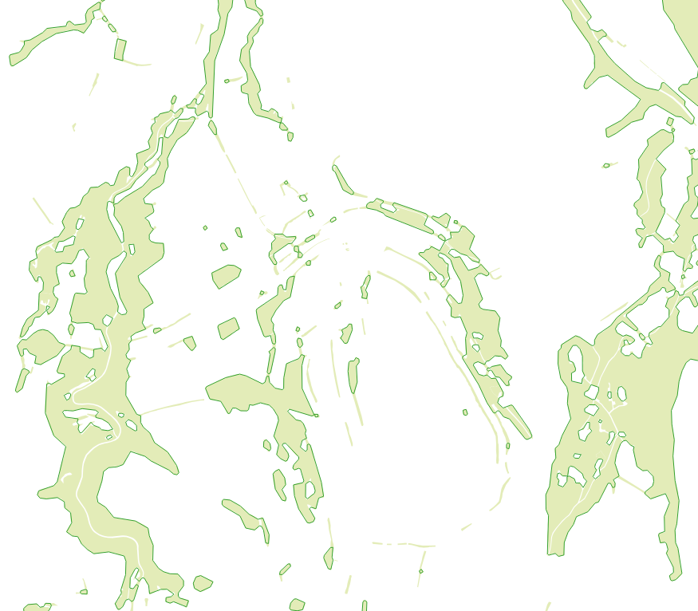

# FOSSGIS2023 PostGIS Generalisierungs Demosession

Code zur [Demosession auf der FOSSGIS 2023](https://pretalx.com/fossgis2023/talk/KNLSJN/) von Robert Klemm und Mathias Gröbe

## Inhalt

 - Lua-Skripte zum Import und Reporijzieren der OSM-Daten in eine Datenbank (Zielschema "public", EPGS:23633)
 - Funktionen für die Generalisierung (jeweils mit Verweise auf Quellen)
 - Abfolge von SQL-Befehlen zur Generalisierung von Wald und Gebäuden (Schema "map")
 - Beispiel für Verdrängung von Punkten und Linien (Schema "displacement")

## Beispiele

Für vier verschiedene Beispile sind Mögllichkeiten zur Generalisierung aufgezeigt, welche mittels PostGIS Funktionen in PostgreSQL implementiert wurden. Die Lösungen sind jeweils auf vergleichbare Objektklassen übertragbar und sollten an den jeweiligen Zielmaßstab angepasst werden. Wie man die Werte dafür ermittelt wird [hier](https://pretalx.com/fossgis2021/talk/38SRQD/) zum Beispiel erklärt. Weitere Beispiele sind ebenfalls [hier](https://github.com/MathiasGroebe/FOSSGIS2022-PostGIS-Generalisierungs-Demo) verfügbar.

### Vereinfachung von Wald mittels Puffern

Bespiel für die Vereinfachung von Waldfächen. Dafür sind angrenzende Flächen vereinigt, kleine Lücken zwischen den Flächen geschlossen worden, die Geometrie vereinfach und zu kleine Flächen bzw. Löcher in diesen entfernt. Die Arbeitsschritte lassen sich auf andere nicht rechtwinklige Flächengeometrien von Landbedeckung oder Landnutzung wie zum Beispiel Wiesen, Ackerfläche oder Gewässerflächen übertragen. Das Ergebniss ist umrandet dargestellt, die ursprüngliche Geometrien als nicht umrandete Fläche.

### Vereinfachung von Gebäuden mittels Puffern

Das Beispiel für die Vereinfachung von Gebäuden nutzt eine Abfolge von rechtwinkligen Puffern zur Vereinfachung der Gebäuden. Die angrenzenden Gebäudepolygone wurden dafür zuvor vereinigt und dann mittel Puffern vereinfach. Weil dadurch lange, schmale und kleine Gebäude wegfallen, werden diese anschließend noch einmal besonder behandelt und bei hinreichender Größe wieder hinzugefügt. Die Arbeitschritte sind spezfisch für Gebäude und setzen rechtwinklige Flächen voraus. Denkbar ist hier auch eine Anwendung auf Landnutzungflächen wie die von bebauten Flächen.

### Verdrängung von Wegweisern durch Straßen und Wege

Möglichst verständliches Beispiel wie Verdrängung sich für Wegweiser die nicht zu nah an Wegen bzw. Straßen plaziert werden sollen. Dafür sind zwei Schritte notwenig:

1. __Konflikte ermitteln__: Umheraus zu finden, wo Konflikte bestehen müssen die Wegweiser Punkte und Linien für die Wege gepuffert werden, wobei die Puffergröße die jeweilige Größe der Signatur im Kartenmaßstab darstellen sollte. Im Anschluss lässt sich durch Verschneidung ermitteln, welche Wegweiser verdrängt werden müssen.

2. __Verdrängung__: Die Konflikte werden betrachtet und eine neue konfliktefreie Position für die Wegweiser ermittelt. Dafür wird die kürzste Linie zwischen Außenrand der gepufferten Wege und der Wegweiserpsotion als Richtung verwendet und so verlängert, dass der Abstand hinreichend groß wird.

Das Beispielbild zeigt die Verdrängung von Wegweisern, die an ihren neuen Positionen dargestellt werden. Der gelbe Punkt zeigt die orginale Position und die Linie dahin den Verschiedbungsvektor.

*Achtung, die Lösung ist nicht perfekt und sehr stark vom Maßstab und den verwendeten Signaturen abhängig!*

### Verdrängung von Strommasten durch Straßen

## Benötige Software

 - PostgreSQL 13+
 - PostGIS 3+
 - osm2pgsql 1.7+

## Beitragen

Hinweise, Verbesserungsvorschläge und Ideen sind gerne gesehen. Hilf mit bessere Karten zu machen und teile dein Wissen mit uns! Die hier gesammelten Ansätze basieren auf bestehenden Funktionen kombniert eigenen Ideen.
